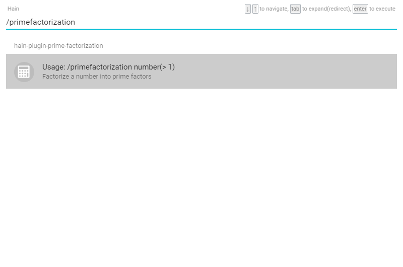

# hain-plugin-prime-factorization

A [Hain](https://github.com/appetizermonster/hain) plugin for factorizing a number into prime factors.




## Install

```
/hpm install hain-plugin-prime-factorization
```


## Usage

```
/primefactorization [number]
```

```[number]``` should be an integer larger than 1.


## LICENSE

MIT License
